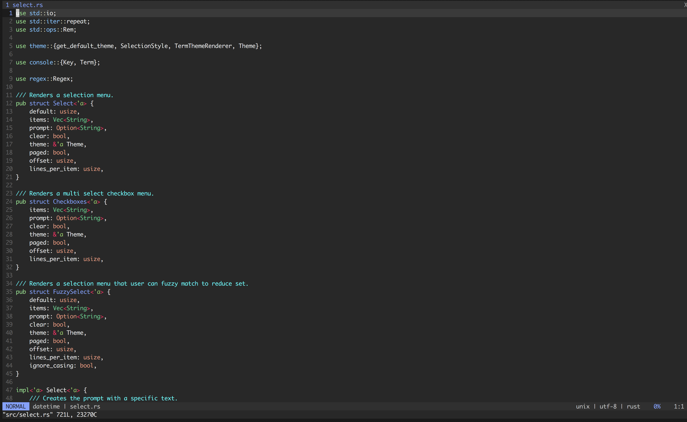

# crustacean.vim
A dark vim/neovim colorscheme. The theme is a combination of `bluz71/vim-moonfly-colors` and `tender`, with a smattering of adjustments to fit the Rust styling that I liked best.



## Installation
**Vundle**  
Add the following to your `.vimrc`:  
```
Plugin 'slaterb1/crustacean.vim'
```

Then run `PluginInstall`.

Add `crustacean.vim` to your `~/.vim/colors/` directory to enable setting `colorscheme crustacean` in your `.vimrc`.
